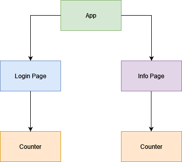
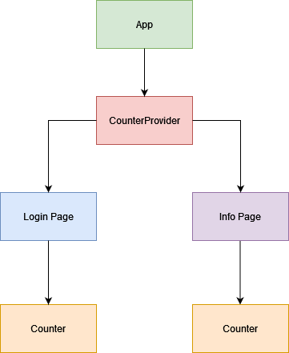
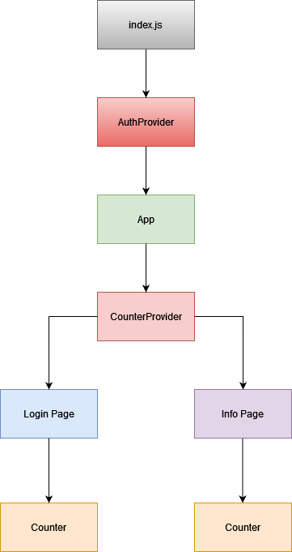

# React Context Demo

- Simple Auth / Login App
- Demonstrates Context Providers and useContext
- accepts any username / email address & password
- creates a dummy userId for the newly logged in user
- sets `auth` state to logged in and shows User Info with logout button

- uses `CounterProvider` component to wrap `<Info>` and `<Login`> in `Appjs`
- uses `AuthProvider` component to wrap `<App>` in `index.js`

# Before Context Providers

# After Counter Provider

# After Auth Provider
